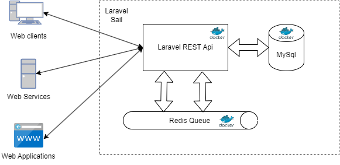
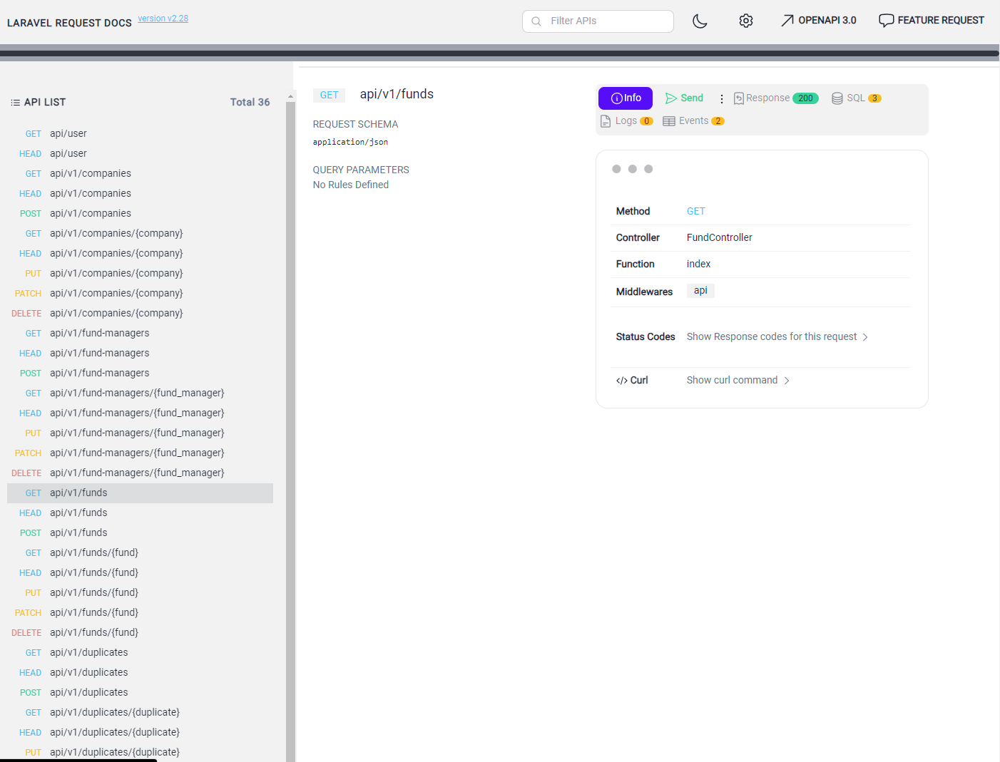
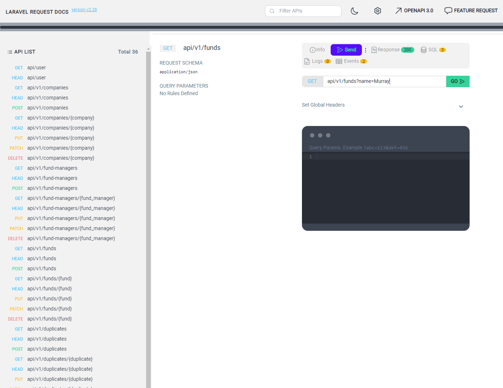
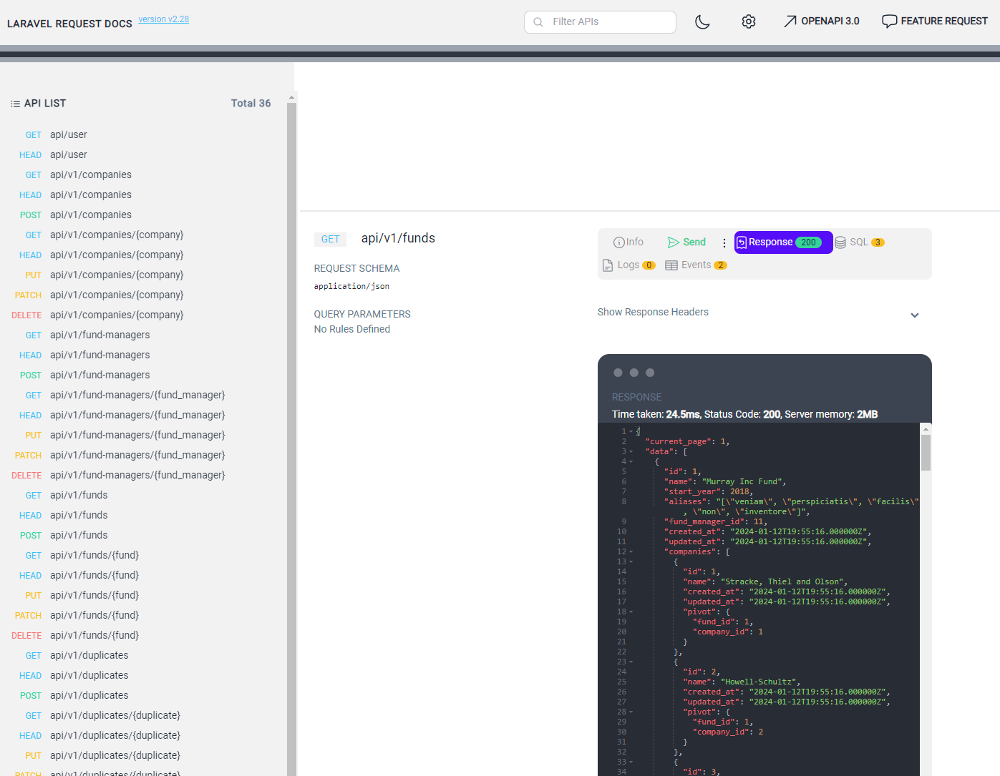

# Fund manager project

This is a Laravel 10 application that provides access to a number of REST APIs, managing records for funds, fund managers, and companies. It also has a Redis queue configured, all running over Sail, which is a Docker-based environment.

## Application Architecture

### Entity Relationship diagram

The application has the following entities: Fund, Fund Manager, Company, Duplicates, additionally it has a pivot table to map the many to many relationship between Company and Fund.


### Architectural Overview

The application follows the client server architecture and exposes all the resources as REST endpoints supporting the standard GET, POST, PUT and DELETE http methods, all supporting services run inside docker using Laravel's sail utilities. The event handler to store duplicate funds is implemented using a message queue that listens to any duplicated fund warning event and after that creates a new record on the duplicates table.



### Design

The application is designed with a well-structured architecture that clearly separates concerns among different entities: funds, fund managers, companies, and duplicates. Here's a brief explanation:

- **Entities**: Each entity (funds, fund managers, companies, duplicates) is represented by a model in Laravel. These models interact with the database and encapsulate the business logic related to their respective entities.

- **Controllers**: The application has controllers for each entity that handle HTTP requests and responses. These controllers use the models to interact with the database and return the appropriate responses.

- **Queue**: The application uses Laravel's queue system with Redis to handle the creation of duplicate funds. This approach offloads potentially time-consuming tasks from the main request-response cycle, improving performance.

- **API Documentation**: The application uses request-docs to document the API, making it easier for other developers to understand and use the API.

## Scalability Strategies

As the application grows, various scalability strategies can be considered, the following ones can be implement at infrastructure level without significant code changes:

- **Database Scaling**: As the data grows, database scaling strategies like database sharding (splitting data across multiple databases) or replication (having multiple copies of the database) may be needed.

- **Caching**: Implementing a caching layer can significantly improve the performance of the application. Laravel supports popular caching backends like Memcached and Redis out of the box.

- **Load Balancing**: If the application receives a high amount of traffic, the load might need to be distributed across multiple servers using a load balancer.

If the application growns in complexity an architecture change could be implemented easily considering the separation of concerns of the implemented design.

- **Microservices**: If the application continues to grow in complexity, it might be beneficial to break it up into microservices. This involves splitting the application into smaller, independently deployable services.

## Prerequisites

Before you begin, ensure you have met the following requirements:

- You have installed the latest version of [Docker](https://www.docker.com/get-started) and [Docker Compose](https://docs.docker.com/compose/install/).
- You have a basic understanding of Laravel and Docker.

## Installation

Follow these steps to get your development environment set up:

1. Clone the repository
```bash
git clone https://github.com/your-repo-url
```
2. Navigate to the project directory
```bash
cd your-project-directory
```
3. Start the Laravel Sail development environment
```bash
./vendor/bin/sail up
```
4. Run the migrations
```bash
./vendor/bin/sail artisan migrate
```
5. Seed the database 
```bash
./vendor/bin/sail artisan db:seed
```

## Running the Application

To start the application, use the following command:

```bash
./vendor/bin/sail up
```

After that you need to start the queue process inside sails:
```bash
./vendor/bin/sail artisan queue:work
```

## Using the API Documentation

The application uses the request-docs extension for API documentation. This tool provides a user-friendly interface to interact with the API endpoints. Here's how to use it:

1. Navigate to http://localhost/request-docs in your web browser after the application started. You will see a list of all available API endpoints.

2. Click on an endpoint to expand it. You will see details about the endpoint, including its HTTP method (GET, POST, etc.), the URL path, and any required or optional parameters.

3. To test an endpoint, fill in any required parameters and click the "Send" button. The tool will open a section where you could add payload data or modify some query parameters.

4. After that you press the "Go" button and the request will be executed and a response payload would be displayed below.

For example, to test the `GET /funds` endpoint:

1. Click on the `GET /funds` endpoint to expand it.



2 Click on the Send button


2. If there are any optional parameters you could add them as query paramenters, for the funds request supported parameters are `page`, `name`, `start_year`, `alias`, the page serves for pagination purposes the latter are used for filtering.



3. Click the "Go" button. You should see a list of funds in the response.



Remember, the actual endpoints will depend on the application's API. Always refer to the request-docs interface for the most up-to-date information.

Additionally when you try to send data thru a post endpoint you will see a sample of the expected data, you could check the following example for reference, to create a new fund resource using the POST fund method:

```json
{
    "name": "test-fund-2",
    "start_year": 2011,
    "fund_manager_id": 20,
    "companies": [46, 47],
    "aliases": ["some", "ax"]
}
```